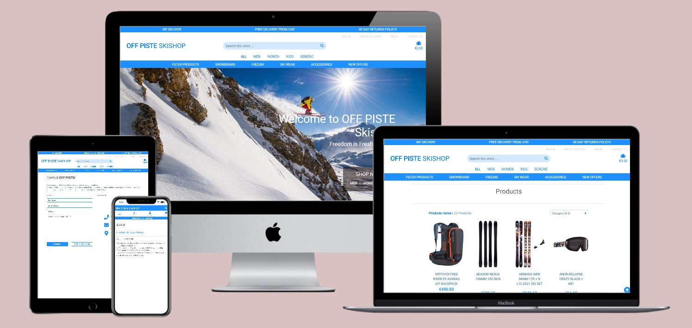
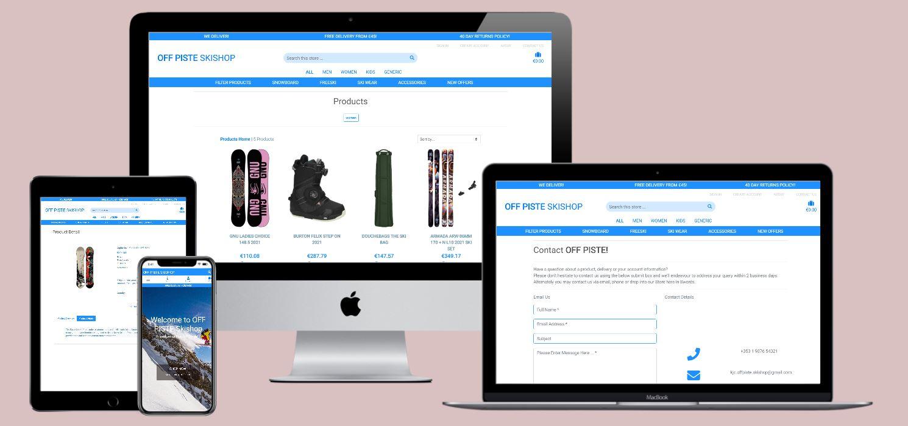

--------
<h1 align="left">Ken Cormican | Milestone Project Four</h1>


<h2 align="left">Full Stack Frameworks with Django</h2>


## Table of Contents

**<details><summary>Project Overview</summary>**
* [Demo](#demo)
* [Travis CI](#travis-ci)
* [Responsive Mockups](#responsive-mockups)
* [Purpose](#purpose)
* [Project Brief](#project-brief)

</details>

**<details><summary>User Experience (UX)</summary>**
* [UX](#user-experience-(ux))

<!-- **<details><summary>User Experience (UX)</summary>**

* [UX](#user-experience-(ux))
* [Strategy](#strategy)
* [Scope](#scope)
* [Structure](#structure)
* [Skeleton](#skeleton)
</details> -->


**<details><summary>Strategy</summary>**
* [Strategy](#strategy)
* [User Stories](#user-stories)
</details>

**<details><summary>Scope</summary>**
* [Scope](#scope)
* [Preparation](#preparation)
</details>


**<details><summary>Structure</summary>**
* [Structure](#structure)
* [Application Structure](#application-structure)

**<details><summary>Database Structure (Django Models)</summary>**
* [Database Structure](#database-structure)
* [User Profile Model](#user-profile-model)
* [Main Category Model](#main-category-model)
* [Subcategory Model](#subcategory-model)
* [Product Model](#product-model)
* [Order Model](#order-model)
* [Order Line Items Model](#order-line-items-model)
* [Contact Model](#contact-model)

</details>
</details>


**<details><summary>Skeleton</summary>**
* [Skeleton](#skeleton)
* [Navigation](#navigation)
* [Authentication](#authentication)
* [Wireframes](#wireframes)
</details>

**<details><summary>Surface</summary>**
* [Colour Scheme](#colour-scheme)
* [Typography](#typography)
* [Imagery](#imagery)
* [Responsive Elements](#responsive-elements)
* [Interactive Elements](#interactive-elements)
</details>

</details>

**<details><summary>Deployment</summary>**

* [Deployment](#deployment)

**<details><summary>Development Environment</summary>**
* [Development Environment](#development-environment)
* [Making a Local Clone of the GitHub Repository](#making-a-local-clone-of-the-github-repository)
* [Local Development Environment](#local-development-environment)
* [IDE BASH terminal](#ide-bash-terminal)
</details>

**<details><summary>Production Environment</summary>**
* [Production Environment](#production-environment)
* [Deployment Prerequisites](#deployment-prerequisites)
* [Configure Stripe Dependencies](#configure-stripe-dependencies)
* [Configure AWS S3 Dependencies](#configure-aws-s3-dependencies)
* [AWS CORS Config](#aws-cors-config)
* [Deploy To Heroku](#deploy-to-heroku)
* [Setup Requirements](#setup-requirements)
* [Setup Procfile](#setup-procfile)
* [Heroku](#heroku)
* [Create a new application](#create-a-new-application)
* [Connecting to the GitHub repository](#connecting-to-the-github-repository)
* [Setup the Config Vars](#setup-the-config-vars)
* [Automatic Deployment](#automatic-deployment)
* [The Project is now deployed](#the-project-is-now-deployment)
</details>
</details>


**<details><summary>Testing</summary>**

<p>Note* this READme uses as seperate TEST.md to capture the testing components.</p>

* [Testing](TEST.md)
</details>

***


## Demo

[View the live project here.](https://kjc-off-piste-skishop.herokuapp.com/)


--------
## Travis CI
[](https://travis-ci.com/kencormican/milestoneProjectFour)

--------

## Responsive Mockups

<h2 align="center"></h2> 

***

<h2 align="center"></h2> 

--------

## Purpose

Winter sports such as Skiing & Snowboarding have become increasingly popular within Ireland over the past two decades.   
With that in mind I've decided to make the sale of Ski and Snowboard related goods the focus of this ecommerce website.

In doing so I hope the provide a positive user experience that utilizes HTML, CSS, Bootstrap, Python, Django, Heroku, Postgres & Stripe and demonstrates the skills I've developed under the tutelage of the Code Institute team while studying the Diploma in Full Stack Development.
Time permitting, in addition to the above I'm also hoping to capture some of the backend validation and redundancy described, in particular during the Webhooks tutorials.

***


[Back to Contents](#table-of-contents)

--------


## Project Brief

The brief was to create a full-stack site based around the business logic used to control a centrally-owned dataset.
The developer is tasked with providing an authentication mechanism and paid access to the site's data and/or other activities based on the dataset, such as the purchase of a product/service.  
In creating the site, the developer should expose the learnings from the HTML, CSS, JavaScript, Python, Django & Relational Database Modules. 


1. Design, develop and implement a full stack web application, with a relational database, using the Django/Python full stack MVC framework and related contemporary technologies.
2. Design and implement a relational data model, application features and business logic to manage, query and manipulate relational data to meet given needs in a particular real-world domain.
3. Identify and apply authorisation, authentication and permission features in a full stack web application solution.
4. Design, develop and integrate an e-commerce payment system in a cloud-hosted full stack web application.
5. Document the development process through a git based version control system and deploy the full application to a cloud hosting platform.
6. Test the application through the development, implementation and deployment stages.
7. Deploy a final version of the full-stack application code to a cloud-based hosting platform (e.g. Heroku) and test to ensure it matches the development version .
8. Demonstrate and document the development process through a version control system. 

***


[Back to Contents](#table-of-contents)

--------

# User Experience (UX)

# Strategy

Use the Bootstrap and Django Frameworks, in conjunction with Postgres and the Stripe API to render a clean, robust fully functional ecommerce site.  
The Website should be responsive, allowing end users to purchase goods, register to the site and perform the full set of CRUD operations on their shopping baskets.
The end users should be able to view all products or search based on category, price or rating criteria.
In addition to the above, end users should be able to select individual products to view more detailed information.
Admin users should be able to display, add, edit or delete products or categories.
Site structure and purpose should be clear from the outset, providing the end user with an intuitive learning experience.
The website should be fully responsive and clearly display good UX design for small, medium and large breakpoints.

--------


## User stories

Ask Num | Scenario                                                                                                                                              |
:--     | :---------------------------------------------------------------------------------------------------------------------------------------------------  |
1       | As a First Time Visitor, I want to easily understand the main purpose of the site?                                                                    |
2       | As a First Time Visitor, I want to be able to easily navigate the site and search for a product based on Category, Subcategory or my own Criteria     |
3       | As a First Time Visitor, I would like to be able to select and view detailed product information including price, rating and size where applicable    |
4       | As a First Time Visitor, I would like the ability to purchase an item or quantity of items, adding them to my shopping basket in a single step. 	    |
5       | As a First Time Visitor, I would like the ability to view a summary of the contents of my shopping basket.                	       					|
6       | As a First Time Visitor, I would like the ability to edit or delete the contents of my shopping basket.                                               |
7       | As a First Time Visitor, I would like the ability to register to the shopping site and store my details                                               |
8       | As a First Time Visitor, I would like the ability to make a purchase using a secure process   		                                                |
1       | As a Returning Visitor, I would like the ability to login or logout using my profile credentials           			                                |
2       | As a Returning Visitor, I would like the website to provide a facility to display my stored details                   				                |
3       | As a Returning Visitor, I would like the website to provide a facility to sort products based on category, product price, rating etc          		|
1       | As an Admin User, I would like to be able to perform the full set of CRUD operations on categories                                    				|
2       | As an Admin User, I would like to be able to perform the full set of CRUD operations on products                                        				|
1       | As a developer, I would like to be able to provide the back end redundancy described in Stripe Webhook tutorials	                        			|
2	    | As a developer and time permitting, I would like to be able to be in a position to present a clean secure, scalable and error free site	            |


***


[Back to Contents](#table-of-contents)

--------

# Scope

## Preparation
- As part of the preparation for this project I visited  several winter sports ecommerce sites reviewing site structure, theme and content, to gauge how best to approach the design and planning stages. These sites included but were not limited to [Blue Tomatoe](https://www.blue-tomato.com/en-IE/), [Dare2B](https://www.dare2b.ie/) & [53 Degrees North](https://www.53degreesnorth.ie/activity/skiing.html). 

## In scope

- The intent from the outset of the scoping process was to attempt to meet all user requirements and provide additional functionality where possible within the existing time constraints.
- Given the extent of the deliverables and the very tight timelines (submission must be made by end of Jan'21), I thought it prudent to utilise the Tutorial code where possible without making my site derivative. To that end I've decided to create Nine Django Apps - Home, Contact, About, Profile, Categories, Products,  Shopping Bag & Checkout 

***

[Back to Contents](#table-of-contents)

--------

# Structure

## Application Structure
* A home application used to render the store landing page styled to adhere to the overall site theme.
* A contact application to provide providing a form that will allow end users to contact the store owner or site admin.
* An about application to render site about details.  Note* I created this outside of the home application because, post submission, I intend on introducing additional functionality. The intent is to provide a site admin with a full set of CRUD capabilities for the about page.
* A categories application that will provide a site admin with the CRUD capabilities associated with the product categories. This will be rendered to adhere to the site theme and be wired up to the products views, such that, new categories will be automatically added to a New Offers dropdown in the main-nav.  In addition to the Categories CRUD capabilities available in the application a set of 22 Categories (4 Main & 18 Subcategories) will be loaded via manually created JSON files and the Django fixtures feature.
* A profiles application that will be wired up to the end users order history (time permitting) and utilising the allauth package to provide additional authentication, confirmation and user account functionality.  These templates will be customised to adhere the winter sports site theme.
* A Products app used to render site products & details. Admin users will have CRUD capabilities for all products.  
Again per Category app items the initial set of products will be loaded via a manually created JSON file and the Django fixtures feature.  
Note* as mentioned above, in an effort to use my limited time as efficiently as possible, much of the product code will be derived from the CI Tutorials.  So Thank you kindly in advance Chris!  
I do, however, fully intend to customise the code, style it differently and provide additional functionality where possible.  The intent, again time permitting, is to provide additional stock monitoring logic, and for the Detailed templates some carousel and tabbed views.
* A Shopping Bag application will provide the end user with the ability to add, delete and manipulate bag items.  Again much of the code will have to be derived from the Tutorials.
* The Shopping bag app will be wired up to a Checkout application, which will use Stripe to provide a secure mechanism to make payments.  Time permitting I'll attempt to introduce webhooks and signal functionality to provide additional redundancy.
* The plan is to wire all this up to AWS's S3 to provide static file storage but this may not be possible in the tight timeframe.  As a result I intend to provide a Heroku based deployment using the Whitenoise package as a fallback.
* Re front end capabilities. I intend on creating uniquely styled base templates, navigation and  mobile views as a differentiator.  
* Re backend capabilities I've decided to turn the tutorial development sequence on it's head, deploying the site to Heroku as a first step.  This is followed by development of the Profiles, Homepage, About, Contact, Categories, Product, Bag & Checkout applications in that sequence.  The thought process here is that it will communicate, a decent understanding of the underlying coding mechanisms and how to tie Django applications together.

***

[Back to Contents](#table-of-contents)

## Database Structure

### User Profile Model
Name			        |  Properties                                                                                                               		    |
:--    			        | :-----------------------------------------------------------------------------------------------------------------------------------  |
user    		        | models.OneToOneField(User, on_delete=models.CASCADE)                                                                                  |
default_phone_number    | models.CharField(max_length=20, null=True, blank=True)                                                                                |
default_street_address1 | models.CharField(max_length=80, null=True, blank=True)                                                                                |
default_street_address2 | models.CharField(max_length=80, null=True, blank=True)                                                                                |
default_town_or_city    | models.CharField(max_length=40, null=True, blank=True)                                                                                |
default_county          | models.CharField(max_length=80, null=True, blank=True)                                                                                |
default_country         | CountryField(blank_label='Country', null=True, blank=True)                                                                            |


### Main Category Model
Name			        |  Properties                                                                                                               		    |
:--    			        | :-----------------------------------------------------------------------------------------------------------------------------------  |
name                    | models.CharField(max_length=254)                                                                                                      |
friendly_name           | models.CharField(max_length=254, null=True, blank=True)                                                                               |

### Subcategory Model
Name			        |  Properties                                                                                                               		    |
:--    			        | :-----------------------------------------------------------------------------------------------------------------------------------  |
name                    | models.CharField(max_length=254)                                                                                                      |
friendly_name           | models.CharField(max_length=254, null=True, blank=True)                                                                               |
new                     | models.BooleanField(default=False, null=True, blank=True)                                                                             |

### Product Model
Name			        |  Properties                                                                                                               		    |
:--    			        | :-----------------------------------------------------------------------------------------------------------------------------------  |
category                | models.ForeignKey('categories.Category', null=True, blank=True, on_delete=models.SET_NULL)		             						|
subcategory             | models.ForeignKey('categories.Subcategory', null=True, blank=True, on_delete=models.SET_NULL)     	         						|
sku                     | models.CharField(max_length=254, null=True, blank=True)                                                                               |
name                    | models.CharField(max_length=254)                                                                                                      |
quantity                | models.PositiveIntegerField(default=1, max_value=99, null=True, blank=True)                                                           |
price                   | models.DecimalField(max_digits=6, decimal_places=2)                                                                                   |
rating                  | models.DecimalField(max_digits=6, decimal_places=2, null=True, blank=True)                                                            |
summary                 | models.TextField(null=True, blank=True)                                                                                               |
details                 | models.TextField(null=True, blank=True)                                                                                               |
has_sizes               | models.BooleanField(default=False, null=True, blank=True)                                                                             |
image_url_1             | models.URLField(max_length=1024, null=True, blank=True)                                                                               |
image_1                 | models.ImageField(null=True, blank=True)                                                                                              |
image_url_2             | models.URLField(max_length=1024, null=True, blank=True)                                                                               |
image_2                 | models.ImageField(null=True, blank=True)                                                                                              |

### Order Model
Name			        |  Properties                                                                                                               		    |
:--    			        | :-----------------------------------------------------------------------------------------------------------------------------------  |
order_number	        | models.CharField(max_length=32, null=False, editable=False)                                                                           |
user_profile            | models.ForeignKey(UserProfile, on_delete=models.SET_NULL, null=True, blank=True, related_name='orders')                               |
full_name		        | models.CharField(max_length=50, null=False, blank=False)                                                                              |
email   		        | models.EmailField(max_length=254, null=False, blank=False)                                                                            |
phone_number            | models.CharField(max_length=20, null=True, blank=True)                                                                                |
street_address1         | models.CharField(max_length=80, null=True, blank=True)                                                                                |
street_address2         | models.CharField(max_length=80, null=True, blank=True)                                                                                |
town_or_city            | models.CharField(max_length=40, null=True, blank=True)                                                                                |
county                  | models.CharField(max_length=80, null=True, blank=True)                                                                                |
country                 | CountryField(blank_label='Country', null=True, blank=True)                                                                            |
date                    | models.DateTimeField(auto_now_add=True)                                                                                               |
delivery_cost           | models.DecimalField(max_digits=6, decimal_places=2, null=False, default=0)                                                            |
order_total             | models.DecimalField(max_digits=10, decimal_places=2, null=False, default=0)                                                           |
grand_total             | models.DecimalField(max_digits=10, decimal_places=2, null=False, default=0)                                                           |
original_bag            | models.TextField(null=False, blank=False, default='')                                                                                 |
stripe_pid              | models.CharField(max_length=254, null=False, blank=False, default='')                                                                 |


### Order Line Items Model
Name			        |  Properties                                                                                                               		    |
:--    			        | :-----------------------------------------------------------------------------------------------------------------------------------  |
order       	        | models.ForeignKey(Order, null=False, blank=False, on_delete=models.CASCADE, related_name='lineitems')                                 |
product  		        | models.ForeignKey(Product, null=False, blank=False, on_delete=models.CASCADE)                                                         |
product_size	        | models.CharField(max_length=2, null=True, blank=True)                                                                                 |
quantity                | models.IntegerField(null=False, blank=False, default=0)                                                                               |
lineitem_total          | models.DecimalField(max_digits=6, decimal_places=2, null=False, blank=False, editable=False)                                          |

### Contact Model
Name			        |  Properties                                                                                                               		    |
:--    			        | :-----------------------------------------------------------------------------------------------------------------------------------  |
full_name		        | models.CharField(max_length=50, null=False, blank=False)                                                                              |
email   		        | models.EmailField(max_length=254, null=False, blank=False)                                                                            |
subject                 | models.CharField(max_length=80, null=True, blank=True)                                                                                |
message                 | models.TextField(null=False, blank=False)                                                                                             |

***
    
[Back to Contents](#table-of-contents)


# Skeleton

## Navigation
-   Having reviewed several online ski shops it appears to be the convention to allow the end user to filter based on gender and age as well as product type. Snow/Skiwear is categorised not only by product type but whether it's targeting Men, Women or Children.  
There are several approaches to achieving this on the production sites, however, I've decided to use a three layer tabbed nav menu on desktop views and a two layer collapsible sidenav menu on mobile/tablet views.  
In maintaining this convention, it is hoped that it will make the site more intuitive for end users.
- In addition to the above I've also used an collapsible search box on mobile/tabled view and a fixed top nav search on desktop views.  
- Finally, in an attempt to, again enhance UX, I've separated site admin and product related elements into there own menus.
- Sign In/Out, Account, and Admin menus will be hidden or displayed depending on whether a user is anonymous, registered, a superuser or logged in.

## Authentication
-	The Profiles app when used in conjunction with Django's inbuilt capabilities and the allauth package provide the site with the functionality to authenticate users, send confirmation emails, reset passwords etc via multiple allauth templates customised work within the sites theme and colour scheme.
-	Jinga if statements, targeting the user session, were used on Sign In/Out, Account, and Admin menus and determine whether the menus are hidden or displayed depending on whether a user is anonymous, registered, a superuser or logged in.
-   Finally, back end defensive logic using @login_required and if not request.user.is_superuser:  statements was used to secure the categories, product and profile views. Unauthorised attempts at access should result in the user being returned to teh login page or receiving an error message depending on whether the offending user is registered or not.   


## Wireframes

### Mobile Balsamiq Mockups

#### Landing, About, Registration & Login Pages


#### Product, Category & Checkout Pages


### Tablet Balsamiq Mockups

#### Landing & Registration Pages


#### Login, About & Category Pages


#### Product & Checkout Pages


### Desktop Balsamiq Mockups

#### Landing and About Pages


#### Contact and Register Pages


#### Login and Password Reset Pages


#### Profile and Product Pages


#### Product Detail and Shopping Bag Pages


#### Checkout and Checkout Success Pages


#### Manage Categories and Add Category Pages


#### Add Product and Edit Product Pages


#### Admin Product and Admin Product Detail Pages


***

[Back to Contents](#table-of-contents)


# Surface

## Colour Scheme
-   I felt that a basic light blue theme contrasted against a white background was both aesthetically pleasing and reflected the outdoor winter sports nature of this ecommerce site. 
-   Additional Colour is to be introduced via the poster and images/urls associated with the individual products.
-	Re the Landing Page , I've decided to use a Hero image that immediately communicates the nature of the site and enhances the existing colour theme.

## Typography
-   I've decided to use Roboto family of fonts as defaults with Sans Serif acting as the fallback alternatives.
-   They happen to be my proffered fonts given the crisp, basic styling.
-   I've decided to use Font Awesome icons to highlight functionality and make the site more intuitive.
-	I'll use CSS to customise Bootstrap defaults further. These will include but will not be limited to various degrees of text-shadowing, font-sizes and text decoration
-	Finally, I've used a combination of bootstrap and Jinga methods to alter text capitalisation at various points within the project.

## Imagery
-   The intention was to use Bootstrap card-image components in conjunction with the product image urls to provide a central point of focus for the website. I also intended on using standard Bootstrap card elements, and icons styled with the sites light blue theme to provide secondary points of focus.
-	As described above the Landing Page Hero image is intended to both, enhance the site's theme, and immediately communicate its purpose.
-	A default image poster, is used in the event an admin user fails to select an image during the product creation process. 
-   This poster is be used to populate all empty product card-image elements, thereby maintaining consistency of UX across the site.
-   Finally I've used a rotating Font Awesome Icon as a loading spinner with light blue but transparent background as a loading spinner during the checkout submission process.  I felt it would align with the site them and enhance UX.


[Back to Contents](#table-of-contents)


## Responsive Elements
- I've used the bootstrap fixed nav and collapse classes to provide a more user-friendly experience at different window sizes.
- I've used a collapsible for mobile and tablet devices and fixed top-nav for larger devices.
- The plan was to limit the top nav to Logo, search, reg/user and Admin elements.
- The Delivery info bar will display above or below the Top Nav elements depending on whether the breakpoint is small or large, with bootstraps d-none and d-block helper classes used to achieve same.
- The Main nav is then  used to extend functionality associated with the sales process to the end user.
- The Bootstrap grid system was also used to render Card Images differently for the Products and Categories pages at different breakpoints. A single card was displayed at small breakpoint, with that increasing to 2x, 3x and 4x cards and at the medium, large and XL breakpoints respectively.
-	Several form button elements and input elements were altered to render more cleanly between large and small window sizes.


## Interactive Elements
-   The Bootstrap framework was used to provides a multitude of interactive features for this site.
-	These included but were not limited to carousels, button and text helper classes, modals, form validation, toast notifications, data toggles, collapse menus, interactive tab menus and dropdowns.
-   Product details will display Stock volumes or out of stock depending on database quantity.
-   Ratings information tags are highlighted as gold if greater than zero, blue-grey if zero rated or as No rating if database value is null.
-   Toast messages were introduced on any page that interacted with a form or where items were added, deleted or updated on the Shopping bag.  Feedback via toast notifications was also introduced for Admin users when performing CRUD operations on the category or products elements.
-	The nav bar was customised heavily to render as intended and for the collapsible, top and side-navs to produce to required interactivity.
-	In addition to the above, search result feedback and form update templates were created, and supported on to backend using python to provide the end user with progress indicators.
-   All form elements are designed to use a combination of Bootstrap and Djangos Crispy forms to provide clean, interactive feedback to the end user.
-   Backend form validation is used defensively to ensure the end user inputs the appropriate information.
-   Interactivity is also introduced through Shopping bag icon and bag total counter underneath it.
-   Finally, don't know whether you call interactivity, per-say, but additional feedback is provided to the end user via backend-email functionality, query notification and order email options as well as redirects to success pages on completion of an activity, order history capture and a feedback loop between the profile and checkout processes.


***

[Back to Contents](#table-of-contents)


# Deployment

The project can be deployed using the following steps...

# Development Environment

## Making a Local Clone of the GitHub Repository

1. Log in to GitHub and locate the [GitHub Repository]( https://github.com/kencormican/milestoneProjectFour)
2. Under the repository name, click "Clone or download".
3. To clone the repository using HTTPS, under "Clone with HTTPS", copy the link.
4. Open Git Bash on GitPod or your IDE of choice
5. Change the current working directory to the location where you want the cloned directory to be made.
6. Type `git clone`, and then paste the URL you copied in Step 3.

```
$ git clone https://github.com/kencormican/milestoneProjectFour.git
```

7. Press Enter. Your local clone will be created.

```
$ git clone https://github.com/kencormican/milestoneProjectFour.git
> Cloning into `CI-Clone`...
> remote: Counting objects: 10, done.
> remote: Compressing objects: 100% (8/8), done.
> remove: Total 10 (delta 1), reused 10 (delta 1)
> Unpacking objects: 100% (10/10), done.
```

Click [Here](https://help.github.com/en/github/creating-cloning-and-archiving-repositories/cloning-a-repository#cloning-a-repository-to-github-desktop) to retrieve pictures for some of the buttons and more detailed explanations of the above process.

***

[Back to Contents](#table-of-contents)


## Local Development Environment
To run this project locally on your system - you will need the following components installed on your system:

* Python 3.8 including PIP.
* An IDE for example - GitPod.
* GIT for cloning and version control.
* Django to provide framework dunctionality and sqlite3 database either locally.

## IDE BASH terminal

1. Install all local dependencies using the following shorthand 
```
pip3 install -r requirements.txt
```
- These include Django, Allauth, Pillow, Django-Crispy-Forms, Django-Countries for local dev environment.
- Whitenoise if you want to deploy to Heroku using static files without AWS services.
- Stripe for secure financial transaction 
- Remote Database dependencies including Psycopg2, Gunicorn & DJ-Database-URL
- Remote Storage AWS S3 dependencies including Boto3 and Django-Storages

- The above shorthand represents the below indiviual commands

```
pip3 install django                             ## framework dependency
pip3 install django-allauth                     ## required for auth related activities.
pip3 install pillow				                ## required for image field in products app
pip3 install django-crispy-forms		        ## required for form structure
pip3 install stripe				                ## required for secure payments
pip3 install django-countries 			        ## required for stripe country dropdown
pip3 install psycopg2-binary					## install psycopg2 postgres package
pip3 install gunicorn							## install gunicorn, green unicorn web server package
pip3 install dj-database-url					## install dj-database-url package to connect to remote database
pip3 install whitenoise     					## install whitenoise to work with static files on Heroku (I uses for testing only)
pip3 install boto3           					## install boto3 to work with aws s3 services
pip3 install django-storages   					## install django-storages to provide storage backends

```

2. Perform initial model migration for django sqlite3 database.
```
python3 manage.py migrate                       ## perform initial migration 
```

3. Create env.py and .gitignore 

```
 touch env.py
 touch .gitignore
```

4. Target env.py with .gitignore 

```
 __pycache__/
 env.py
*.pyc 
*.sqlite3
```
***

[Back to Contents](#table-of-contents)

5. Store all sensitive data including Postgres URL, Django Secret, Heroku Hostname, Email backend host and password, Stripe Currency, Public, Private &   Webhook Keys, AWS Bucket Name, Region, Access Key ID and secret key,  as environmental variable within env.py. I've also stored the Site contact details including, phone, location and email address to act as a central repo for same and make the project a little more scalable.

```
import os

# development environment specific variables
os.environ.setdefault('DEVELOPMENT', 'True')

# django key 
os.environ.setdefault('SECRET_KEY', '<enter django secret key here>')

# heroku  specific variables
os.environ.setdefault('DATABASE_URL', '<enter heroku postgres url here without protocol prefix>')
os.environ.setdefault('HEROKU_HOSTNAME', '<enter heroku app url here without protocol prefix>')

# email back-end variables
os.environ.setdefault("EMAIL_HOST_USER", "<enter host email address here>")
os.environ.setdefault("EMAIL_HOST_PASS", "<enter host 2 stage password here>")

# stripe variables
os.environ.setdefault("STRIPE_PUBLIC_KEY", "<enter stripe public key here >")
os.environ.setdefault("STRIPE_SECRET_KEY", "<enter stripe secret key here >")
os.environ.setdefault("STRIPE_CURRENCY ", "enter stripe currency here")
os.environ.setdefault("STRIPE_WH_SECRET", "<enter stripe webhook key here >")

# aws variables
os.environ.setdefault("AWS_STORAGE_BUCKET_NAME", "<enter aws s3 bucket name here>")
os.environ.setdefault("AWS_S3_REGION_NAME", "<enter aws region here>")
os.environ.setdefault("AWS_ACCESS_KEY_ID", "<enter aws key id here>")
os.environ.setdefault("AWS_SECRET_ACCESS_KEY", "<enter aws secret key here>")

# site contact detail variables
os.environ.setdefault("SITE_ADDRESS", "<enter site address here>")
os.environ.setdefault("SITE_MAP_LOCATION", "<enter site google map location url here>")
os.environ.setdefault("SITE_PHONE", "<enter site phone number here>")

```
6. Create admin user for development app using:
```
python3 manage.py createsuperuser
```

7. From the IDE BASH terminal you can run the app locally from the development environment using:
```
python3 manage.py runserver
```

8. Verify app functionality

***

[Back to Contents](#table-of-contents)


## Production Environment

### Deployment Prerequisites

* An active Stripe account
* An active account on AWS Account
* An email account

### Configure Stripe Dependencies

1.  In main Dashboard select "Get your test API keys" and retrieve Public and Private API keys
2.  Select Development and webhooks from side menu
3.  Then Select Add Endpoint
4.  Add Dev environment url and suffix with <checkoutappname>/wh/
5.  Select Receive all events and Add Endpoint
6.  Then Open up new webhook to reveal webhook secret key
7.  This should be repeated for Heroku production url also.


### Configure AWS S3 Dependencies

1. Creat S3 Bucket.  Name should be tied to heroku app name and configured to allow public access     
2. In Bucket Properties, static website hosting should be configured to host website, setting index and error documents to index.html and error.html respectively.
3. In Bucket Pernmissions, apply below to CORS (Cross-origin resource sharing ) configuration located [here](#aws-cors-config):
4. In Bucket Pernmissions, Add new Bucket Policy:
*  Type is S3, 
*  Principal is *, 
*  AWS Sevice is S3,
*  Actions is Get Object, 
*  ARN (amazon resource name) can be retrieved from bucket properties 
*  Add statement, 
*  Then generate policy
5. In IAM (Identity & Access Management) Create Group. Should be meaningful name eg. manage_'BUCKET NAME'
6. Create Policy. 
*  Import S3 JSON full access policy. 
*  Filtered on ARN ['heroku app domain/', and 'heroku app domain/*'. 
*  Attach to Group          
7. Create new User, give user Programmatic access and attach to Group. 
8. Download and store S3 Credentials file with secret key details 


### AWS CORS Config
```
[
  {
      "AllowedHeaders": [
          "Authorization"
      ],
      "AllowedMethods": [
          "GET"
      ],
      "AllowedOrigins": [
          "*"
      ],
      "ExposeHeaders": []
  }
]
```

***

[Back to Contents](#table-of-contents)

### Deploy To Heroku

#### Setup Requirements:
Make sure requirements.txt is up to date.  
requirements.txt tells Heroku what dependencies need to be installed to run the app.

1.  Goto the Bash Terminal
2.  Type the following: 

```
 pip3 freeze --local > requirements.txt
```
3.  Push all changes to GitHub.

#### Setup Procfile:
Heroku looks for this Procfile to find out which file runs the app and how to run it.

1.  Goto the Bash Terminal.
2.  Type the following: 

```
 echo web: python app.py > Procfile

```
3.  Open the Procfile, and if there is an empty line, delete it as it can cause problems with Heroku.
4.  Push file to GitHub.

### Heroku:

#### Create a new application:

1.  Goto the Heroku Dashboard.
2.  Click New.
3.  Select to create a new app.
4.  The Heroku app name must be unique, use "–" instead of spaces, and use lower case letters.
5.  kjc-off-piste-skishop the name I picked for this application.
6.  Select the region closest – In my case Europe
7.  Click create app.
8.  On Resources tab select add-ons, search for Heroku Postgres and select Hobby Free activation.

***

[Back to Contents](#table-of-contents)

#### Connecting to the GitHub repository:
There are several ways to connect this or any app. You can use Heroku CLI to connect as outlined on the Heroku site. However, it's simpler to deploy the site from Github, 
that way you only need to push to GitHub.

1.  Select Github, from the Deployment method section, on the Deploy Tab.
2.  Make sure your GitHub id is displayed and then enter the GitHub repository name and click search.
3.  Once it finds the repository, click connect, to connect to the repository.

#### Setup the Config Vars.
Attempting to deploy at this stage would result in some unwanted application errors, 
this is because we have hidden our environment variables inside the env file, 
and this is not available to Heroku.

1.  Click on settings.
2.  Click on **Reveal Config Vars**.
3.  This is where we tell Heroku what secret variables are required. 
Add the Key-Value pairs as follows: 

KEY		    	        |  VALUE                                                                                                                      		    |
:--    			        | :-----------------------------------------------------------------------------------------------------------------------------------  |
DATABASE_URL  	        | enter heroku postgres url here without protocol prefix                                                                                |
PRODUCTION  	        | TRUE                                                                                                                                  |
SECRET_KEY  	        | enter django secret key here                                                                                                          |
HEROKU_HOSTNAME         | enter heroku postgres url here without protocol prefix                                                                                |
EMAIL_HOST_USER         | enter host email address here                                                                                                         |
EMAIL_HOST_PASS         | enter host 2 stage password here                                                                                                      |
HEROKU_HOSTNAME         | enter heroku postgres url here without protocol prefix                                                                                |
SITE_ADDRESS            | enter site address here                                                                                                               |
SITE_MAP_LOCATION       | enter site google map location url here                                                                                               |
SITE_PHONE              | enter site phone number here                                                                                                          |
STRIPE_PUBLIC_KEY       | enter stripe public key here                                                                                                          |
STRIPE_SECRET_KEY       | enter stripe secret key here                                                                                                          |
STRIPE_CURRENCY         | enter stripe currency here                                                                                                            |
STRIPE_WH_SECRET        | enter stripe heroku specific webhook key here                                                                                         |
AWS_USE                 | TRUE                                                                                                                                  |
AWS_ACCESS_KEY_ID       | enter aws key id here                                                                                                                 |
AWS_SECRET_ACCESS_KEY   | enter aws secret key here                                                                                                             |
AWS_STORAGE_BUCKET_NAME | enter aws s3 bucket name here                                                                                                         |
AWS_S3_REGION_NAME      | enter aws region here                                                                                                                 |

***! Note: You can retrieve this information from the local copy of the env.py file***   

4.  Click on **Hide Config Vars**.

#### Automatic Deployment:
Once the Config Vars has been entered you are ready for Automatic Deployment.

1.  Click on the Deploy Tab.
2.  Click enable automatic deploys.
3.  Select the master branch.
4.  Click Deploy branch

#### The Project is now deployed.


[Back to Contents](#table-of-contents)
